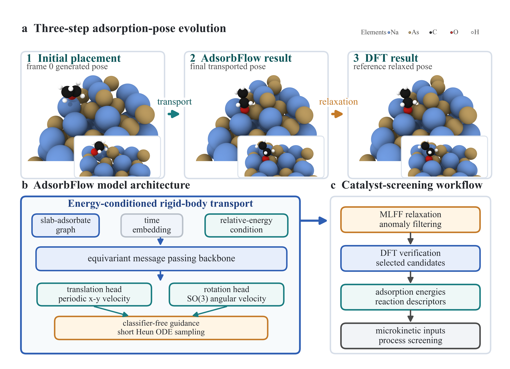

# AdsorbFlow

[](LICENSE)

Energy-conditioned deterministic transport for adsorbate placement in
catalyst-screening workflows.

AdsorbFlow is a conditional flow-matching model for generating plausible
adsorbate placements on catalytic surfaces. It replaces long stochastic
diffusion sampling with a short ODE integration on the rigid-body degrees of
freedom of the adsorbate: in-plane translation and SO(3) rotation. Generated
structures are relaxed with a machine-learned force field, filtered for
geometric anomalies, ranked by relaxed energy, and then verified with DFT when
high-fidelity adsorption energies are needed.

The repository contains the implementation used for the AdsorbFlow manuscript,
including training code, flow samplers, MLFF relaxation utilities, anomaly
detection, OC20-Dense preprocessing scripts, grid-search evaluation, and
DFT-oriented analysis scripts.

<p align="center">
  
</p>

## Documentation

| File | Purpose |
|---|---|
| `DATA.md` | Dataset, checkpoint, and artifact placement |
| `REPRODUCIBILITY.md` | End-to-end reproduction workflow |
| `MODEL_CARD.md` | Intended use, limitations, and evaluation scope |
| `PAPER_RESULTS.md` | Manuscript result tables and audit notes |
| `EXPERIMENT_COMMANDS.md` | Public command templates |
| `docs/REPOSITORY_STRUCTURE.md` | Directory-level repository map |
| `SECURITY.md` | What must not be committed to the public repository |

## What AdsorbFlow Does

AdsorbFlow targets one upstream bottleneck in computational heterogeneous
catalysis: finding a low-energy adsorption geometry before the adsorption
energy is used in descriptor screening, microkinetic modeling, or process-level
catalyst selection.

The standard workflow is:

1. Generate candidate adsorbate poses with an energy-conditioned flow model.
2. Relax each candidate with GemNet-OC or another MLFF.
3. Filter anomalous relaxations such as desorption, dissociation, slab change,
   or intercalation.
4. Rank non-anomalous candidates by relaxed MLFF energy.
5. Verify selected candidates with VASP DFT single-point calculations.

## Main Results

Paper-level DFT verification follows the OC20-Dense placement protocol:
for each system and each SR@k level, the MLFF-best non-anomalous structure
among the first k generated candidates is selected for DFT single-point
verification. A prediction is successful if the verified adsorption energy is
within 0.1 eV of the best-known DFT reference minimum.

### In-distribution OC20-Dense validation

44 systems, MLFF ranking followed by DFT verification.

| Method | Backbone | Steps | SR@1 | SR@2 | SR@5 | SR@10 | Anom.@10 |
|---|---|---:|---:|---:|---:|---:|---:|
| AdsorbML | rule-based | - | 9.1 | 20.5 | 34.1 | 47.7 | 6.8 |
| AdsorbDiff | EquiformerV2 | about 100 | 31.8 | 34.1 | 36.3 | 41.0 | 13.6 |
| AdsorbFlow | EquiformerV2 | 5 | 34.1 | 45.5 | 54.5 | 61.4 | 6.8 |
| AdsorbFlow | PaiNN | 5 | 27.3 | 34.1 | 45.5 | 47.7 | 13.6 |

### Out-of-distribution OC20-Dense validation

50 systems, no overlap with the in-distribution evaluation set.

| Method | Backbone | Steps | SR@1 | SR@2 | SR@5 | SR@10 | Anom.@10 |
|---|---|---:|---:|---:|---:|---:|---:|
| AdsorbFlow | EquiformerV2 | 5 | 28.0 | 46.0 | 54.0 | 58.0 | 6.0 |
| AdsorbFlow | PaiNN | 5 | 32.0 | 42.0 | 44.0 | 46.0 | 6.0 |

### MLFF-level hyperparameter search

The selected paper settings are:

| Backbone | Guidance scale | ODE steps | MLFF SR@10 | DFT SR@10 |
|---|---:|---:|---:|---:|
| EquiformerV2 | 7 | 5 | 72.7 | 61.4 |
| PaiNN | 5 | 5 | 63.6 | 47.7 |

The MLFF-level grid is useful for selecting guidance strength and integration
length before running expensive DFT verification. DFT numbers above are the
paper-level verified results.

## Installation

The code was developed with Python 3.10, PyTorch, PyTorch Geometric, ASE,
e3nn, and OCP-style model utilities. A CUDA-capable GPU is recommended for
training and large-scale inference.

```bash
conda create -n adsorbflow python=3.10
conda activate adsorbflow

pip install torch torchvision torchaudio --index-url https://download.pytorch.org/whl/cu118
pip install pyg_lib torch_scatter torch_sparse torch_cluster torch_spline_conv \
  -f https://data.pyg.org/whl/torch-2.2.0+cu118.html

git clone https://github.com/sunyrain/AdsorbFlow.git
cd AdsorbFlow
pip install -r requirements.txt
pip install -e .
```

For DFT verification, configure VASP separately. The repository provides
input-generation and result-analysis utilities, but does not distribute VASP or
VASP pseudopotentials.

## Data And Checkpoints

Small source files are tracked in Git. Large datasets, generated trajectories,
and most neural-network checkpoints are intentionally excluded by `.gitignore`
(`downloads/`, `checkpoints/`, `grid_search_runs/`, `*.lmdb`, `*.pt`, and
similar outputs).

Use the following map to assemble a reproducible workspace:

| Asset | Purpose | Where to place it |
|---|---|---|
| OC20-Dense trajectories and mappings | raw dense-placement data | `downloads/`, `oc20_dense_mappings/` |
| conditional training LMDB | AdsorbFlow training/evaluation data | `train_allE/` or a configured LMDB path |
| validation ID LMDB | 44-system ID evaluation | `val_nonrelaxed_update/` |
| validation OOD LMDB | 50-system OOD evaluation | `valood50_R1I0.1/` |
| AdsorbFlow checkpoints | pretrained EqV2 and PaiNN generators | `checkpoints/` |
| GemNet-OC relaxer | MLFF relaxation and ranking | `configs/relaxation/gemnet_oc/gemnet-oc.pt` |
| grid-search and DFT artifacts | reported evaluation outputs | `grid_search_runs/`, `grid_search_runs_ood/`, VASP result folders |

Public OC20 and OC20-Dense data should be downloaded from the original Open
Catalyst and OC20-Dense distribution links. If using the compact artifacts from
this project, unpack them into the paths above before running the commands
below. The tracked file `configs/relaxation/gemnet_oc/gemnet-oc.pt` provides the
GemNet-OC relaxation checkpoint used by the repository scripts.

## Training

The main entry point is `main.py`. AdsorbFlow training uses the
`MeanFlowTrainer` implementation in `adsorbdiff/trainers/meanflow_trainer.py`.

Example EquiformerV2 flow training:

```bash
python -u -m torch.distributed.launch \
  --nproc_per_node=2 --master_port=1234 \
  main.py --mode train \
  --config-yml configs/flow/eqv2_conditional_flow.yml \
  --distributed \
  --identifier adsorbflow_eqv2_2d \
  --optim.p_cfg=0.20 \
  --optim.flow.allow_z=False \
  --optim.flow.tr_sigma_z_scale=0
```

Example PaiNN flow training:

```bash
python -u -m torch.distributed.launch \
  --nproc_per_node=2 --master_port=1235 \
  main.py --mode train \
  --config-yml configs/flow/painn_conditional_flow.yml \
  --distributed \
  --identifier adsorbflow_painn_2d \
  --optim.p_cfg=0.20 \
  --optim.flow.allow_z=False \
  --optim.flow.tr_sigma_z_scale=0
```

## Sampling And MLFF Evaluation

The flow sampler is implemented in
`adsorbdiff/relaxation/diffusers/flow_torch.py`. It supports classifier-free
guidance through `cfg_scale` and short ODE integration through `num_steps`.

For MLFF-level hyperparameter sweeps:

```bash
python -u scripts/grid_search_cfg_flow.py \
  --cfg-scales 0 1 3 5 7 10 \
  --num-steps 5 10 30 \
  --flow-checkpoint checkpoints/<adsorbflow_checkpoint>.pt \
  --relax-checkpoint configs/relaxation/gemnet_oc/gemnet-oc.pt \
  --model-type eqv2 \
  --nsites 10 \
  --gpus 4 \
  --master-port 1237 \
  --skip-existing
```

Switch `--model-type painn` for the PaiNN backbone.

## DFT-Oriented Verification

The scripts under `scripts/cluster_vasp/` and `scripts/run_vasp_dft/` support
the paper-style DFT workflow:

| Script | Use |
|---|---|
| `scripts/cluster_vasp/prepare_multilevel_vasp_inputs.py` | select MLFF-best candidates and prepare VASP inputs for SR@k levels |
| `scripts/cluster_vasp/paper_faithful_sr.py` | compute paper-style SR@k from VASP results |
| `scripts/cluster_vasp/compute_fair_sr.py` | analyze per-seed and fair union success rates |
| `scripts/cluster_vasp/analyze_fair_vasp.py` | summarize VASP verification outputs |
| `scripts/eval.py` | MLFF-level success and anomaly evaluation |

These scripts assume that VASP input/output paths and pseudopotential paths are
configured for the local cluster environment.

## Repository Layout

```text
adsorbdiff/
  datasets/                 LMDB dataset wrappers
  models/                   PaiNN, EquiformerV2, GemNet-OC and shared modules
  placement/                adsorbate/slab utilities and anomaly detection
  relaxation/               MLFF relaxation and flow/diffusion samplers
  trainers/                 flow-matching and denoising trainers
configs/
  flow/                     AdsorbFlow training configs
  denoising/                inherited AdsorbDiff configs
  relaxation/gemnet_oc/     GemNet-OC relaxation config and checkpoint
scripts/
  create_lmdbs/             OC20-Dense preprocessing utilities
  cluster_vasp/             DFT input generation and SR analysis
  run_vasp_dft/             VASP execution helpers
  grid_search_cfg_flow.py   MLFF grid search over guidance and step count
PAPER_RESULTS.md            detailed experimental notes and result tables
EXPERIMENT_COMMANDS.md      reproducible command templates
DATA.md                     data and checkpoint placement guide
REPRODUCIBILITY.md          end-to-end reproduction notes
```

## Notes On Scope

AdsorbFlow is not a microkinetic solver, reactor model, or process optimizer.
It is an upstream adsorption-geometry module. Its outputs can be used to
generate more reliable adsorption energies and reaction descriptors before
those quantities are passed into microkinetic, active-learning, or
process-screening workflows.

## Citation

If you use this repository, please cite the AdsorbFlow arXiv preprint and the
upstream projects listed below.

```bibtex
@misc{qiu2026adsorbflow,
  title         = {AdsorbFlow: energy-conditioned flow matching enables fast and realistic adsorbate placement},
  author        = {Jiangjie Qiu and Wentao Li and Honghao Chen and Leyi Zhao and Xiaonan Wang},
  year          = {2026},
  eprint        = {2602.19289},
  archivePrefix = {arXiv},
  primaryClass  = {cs.LG},
  url           = {https://arxiv.org/abs/2602.19289}
}
```

## Acknowledgements

This codebase builds on ideas and utilities from the Open Catalyst Project,
Open-Catalyst-Dataset, AdsorbML, DiffDock, and AdsorbDiff. Please also cite the
corresponding upstream works when using this repository.

The repository is distributed under the MIT license inherited from the upstream
AdsorbDiff codebase.
